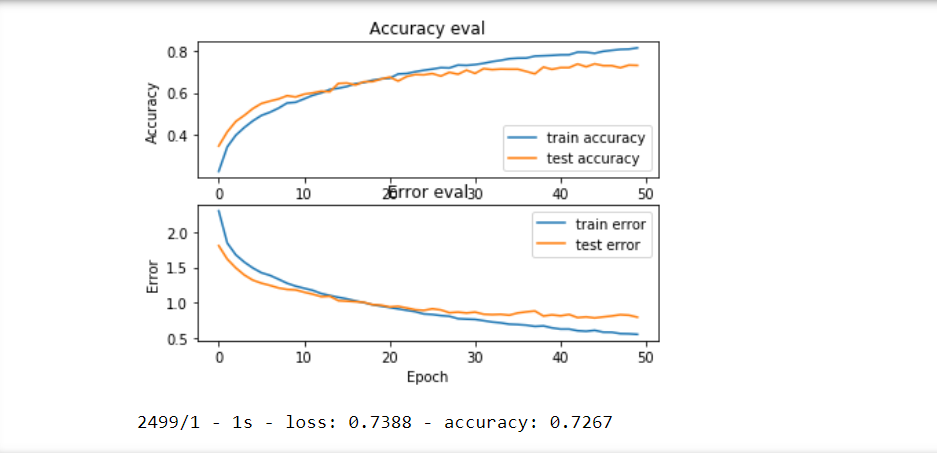

# MUSIC-GENRE-CLASSIFIER

# Abstract
The aim of the project entitled “MUSIC GENRE CLASSIFIER”, is to create an automated system
for classification model for music genres. This music genre classifier will categorize music files
according to their genre. The deep learning approach is used wherein a CNN model is trained endto-end, to predict the genre label of an audio signal, solely using its spectrogram.

# Dataset
For this project we need a dataset of audio tracks having similar size and similar frequency range.
We have used the GTZAN dataset from the [MARYSAS website](http://marsyas.info/downloads/datasets.html) .
The GTZAN genre collection dataset was collected in 2000-2001. It consists of 1000 audio files
each having 30 seconds duration and 22050 Hz. There are 10 classes (10 music genres) each
containing 100 audio tracks. Each track is in .wav format. It contains audio files of the following 10
genres:
• Blues
• Classical
• Country
• Disco
• Hip-hop
• Jazz
• Metal
• Pop
• Reggae
• Rock

# TRAINING MODEL USING CNN:

Using deep learning, we can achieve the task of music genre classification without the need
for hand-crafted features. Convolutional neural networks (CNNs) have been widely used for
the task of image classification. The 3-channel (RGB) matrix representation of an image is
fed into a CNN which is trained to predict the image class. In this Project, the sound wave
can be represented as a spectrogram, which in turn can be treated as an image. The task of the
CNN is to use the spectrogram to predict the genre label (one of Ten classes).

# Results

The Music Genre Classifier produced quite satisfying results with accuracy of 72.67%.
The following is the accuracy and error graph of our classifier model.
  
 Achieved around 72.67% accuracy with test set.

